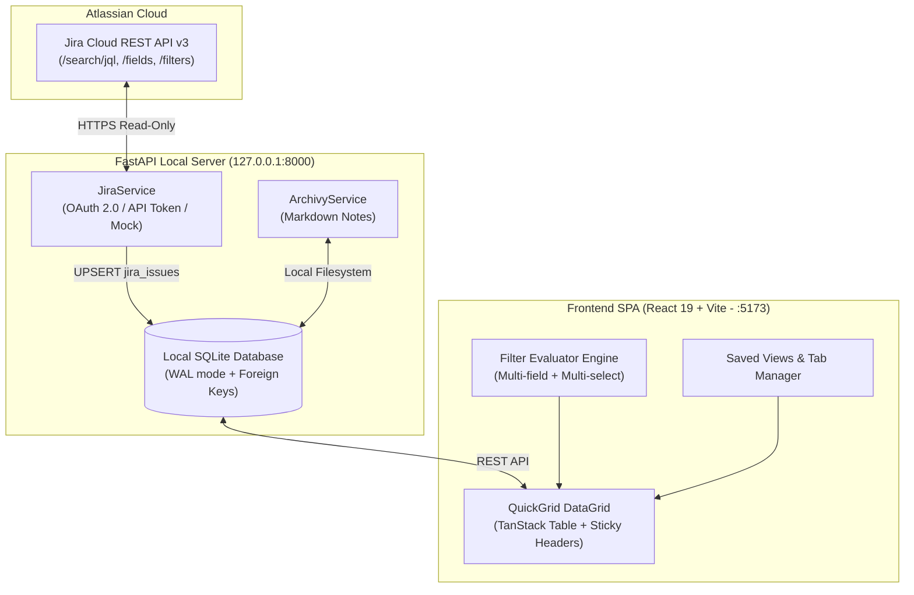

# Jira QuickGrid 🚀
### Visual, Modern & Safe Jira Issue Management with Smart Interactive Grid

[](https://www.python.org/downloads/)
[](https://fastapi.tiangolo.com)
[](https://react.dev/)
[](https://tailwindcss.com/)
[](LICENSE)

A modern, fast, local-first web application that turns your Atlassian Jira workspace into an interactive, spreadsheet-like **QuickGrid**. It gives engineering, QA, and product teams the freedom to organize, filter, and augment Jira issues with **persistent local custom fields** that Jira doesn't have—**without altering your company's Jira schema or risking data overwrites.**

---

## 🔒 Enterprise Safety & Corporate Security

> **Can any team member or employee safely use Jira QuickGrid in their company?**  
> **Yes, 100% safely.** Jira QuickGrid was designed from day one with enterprise security, data privacy, and non-destructive operations as primary architectural pillars.

### Why It Is 100% Safe For Enterprise Use:

1. **Strictly Non-Destructive (Read-Only to Jira Cloud):**
   * The application interacts with Jira exclusively through official Atlassian REST APIs using read-only scopes (`read:jira-work`, `read:jira-user`).
   * It **never** mutates, modifies, or deletes your organization's Jira tickets, workflows, custom fields, or sprint settings.
   * Jira field columns are strictly locked and visually badged with a lock icon in the UI.

2. **Zero Cloud Leakage (100% Local-First Storage):**
   * **No intermediate servers:** Your data moves directly between your browser, your local machine, and your company's Jira instance (`https://your-domain.atlassian.net`).
   * All Atlassian API tokens, OAuth credentials, synced issues, and custom fields are stored locally in an embedded SQLite database (`server/jira_app.db`) on your machine.
   * **Zero telemetry, zero tracking, zero third-party analytics.** Nothing leaves your computer.

3. **No Jira Administrator Rights Required:**
   * In enterprise environments, creating a custom field in Jira often takes weeks of administrative approvals.
   * With Jira QuickGrid, individual contributors, QA engineers, and project leads can create **unlimited local fields** (e.g., *QA Status*, *Internal Priority*, *Target Sprint*, *Blocker Notes*) that exist solely in your local view without bothering Jira administrators or cluttering the global enterprise schema.

4. **Guaranteed No-Overwrite Persistence:**
   * Synced Jira fields and local custom data are stored in completely isolated relational tables.
   * When you click **Update Data (Sync)**, Jira fields are refreshed, but your local notes, custom single-selects, and ratings are **never overwritten or lost**.

---

## 🌟 Key Features

### 1. Interactive Spreadsheet-Style Data Grid
* **Sticky Columns:** `Key` and `Summary` stay fixed on the left while horizontally scrolling through dozens of fields.
* **Smart Multi-Pill Badges:** Arrays such as Jira *Components*, *Labels*, and custom multi-select fields render as pastel badges.
* **Drag-to-Resize & Column Reordering:** Reorder columns directly by dragging headers or through the dedicated Field Manager modal.
* **Dynamic Grouping (Group By):** Group records by Jira Status, Priority, Assignee, or custom Single-Select columns with collapsible group headers and count badges.
* **Field Manager:** Toggle column visibility, reorder columns, rename headers, and inspect field types in a dedicated column management drawer.

### 2. Multi-Field Filter Popover (Smart Logic)
* **Compound Logic:** Combine multiple filter rules with global `AND` (all conditions must match) or `OR` (any condition matches).
* **Multi-Select Operators:** Native support for single and multi-value fields:
  * `has any of`: Matches if the issue contains at least one of the selected tags.
  * `has all of`: Matches if the issue contains every selected tag.
  * `has none of`: Excludes issues containing any of the selected tags.
  * `is exactly`: Matches only issues with the exact set of tags.
* **Auto-Discovery of Available Options:** Dynamically scans issues to populate option pickers with real values (e.g., specific status names, tags, components, or custom field values).
* **Live Counter:** Real-time feedback displaying `"Showing X of Y issues"` as you refine filters.
* **Date & Numeric Operators:** Compare dates (`is before`, `is after`, `is today`) and numbers (`=`, `≠`, `>`, `<`, `≥`, `≤`).

### 3. Saved Views & Layout Tabs
* Save custom configurations including active Jira filter, visible columns, multi-field filter rules, group-by settings, and sorting preferences as dedicated View Tabs.
* Switch instantly between views (e.g., *"Sprint 34 Bugs"*, *"My QA Tasks"*, *"High Priority Needs Review"*).

### 4. Archivy Knowledge Base Integration
* **Side-Drawer Wiki:** Click **"Wiki Doc"** on any row to open a full Markdown editor and live preview panel for that specific ticket.
* **Local Markdown Files:** Notes are saved as portable Markdown files in `server/data/archivy_notes/[KEY].md`, making them fully versionable in Git.

### 5. One-Click PDF Export
* Export the currently filtered, grouped, and sorted grid directly to a clean, professional PDF document ready for sprint reviews and stakeholder meetings.

### 6. Bilingual Support
* Instant 1-click toggle between **English** and **Spanish** (`🌐 Turn to English` / `🌐 Cambiar a Español`).

---

## 🏗️ Architecture & How It Works



### Relational Schema (No-Overwrite Isolation):
* **`jira_issues` table:** Stores official Jira data (key, summary, status, assignee, priority, created/updated dates, and raw fields payload). Updated upon sync.
* **`custom_columns` table:** Stores definitions of your local fields (single-select, text, number, date, archivy-link).
* **`issue_custom_values` table:** Stores custom values indexed by `(issue_key, column_id)`. **Never modified or deleted by Jira sync.**
* **`saved_views` table:** Stores view configurations and active filter condition trees.

---

## 🚀 Quick Start

### Prerequisites
* **Python 3.10+** ([Download Python](https://www.python.org/downloads/)) — Ensure "Add Python to PATH" is checked on Windows.
* **Node.js 18+** ([Download Node.js LTS](https://nodejs.org/))
* **Git** ([Download Git](https://git-scm.com/))

---

### Option 1: 1-Click Launch (Recommended)

#### Windows
Run in PowerShell or double-click:
```powershell
.\start.ps1
```
Or via Windows CMD:
```cmd
run.bat
```

#### macOS / Linux
```bash
chmod +x start.sh
./start.sh
```

This starts both the FastAPI backend (`http://127.0.0.1:8000`) and Vite frontend (`http://localhost:5173`) and automatically opens your browser.

---

### Option 2: Manual Setup

#### 1. Setup Backend
```bash
cd server
python -m venv .venv

# On Windows:
.\.venv\Scripts\activate
# On macOS / Linux:
source .venv/bin/activate

pip install -r requirements.txt
python -m uvicorn main:app --host 127.0.0.1 --port 8000 --reload
```
* Interactive Swagger Docs: `http://127.0.0.1:8000/docs`

#### 2. Setup Frontend
```bash
cd client
npm install
npm run dev
```
* Application URL: `http://localhost:5173`

---

## ⚙️ Connecting to Jira

Click the **⚙️ Settings** icon in the top toolbar to configure your connection:

### 1. Mock Mode (Default)
* No credentials required.
* Instantly loads a realistic sprint dataset for testing and demonstration.

### 2. Jira Cloud API Token (Recommended for Enterprise Users)
Fastest way to connect to your company's Jira Cloud without admin privileges:
1. **Domain:** Enter your Jira domain (e.g., `company.atlassian.net`).
2. **Email:** Your corporate Atlassian email address.
3. **API Token:** Generate an API token at [Atlassian Account Security](https://id.atlassian.com/manage-profile/security/api-tokens).
4. Click **Validate with Jira** and **Save Settings**.

### 3. Atlassian OAuth 2.0 (3LO)
Standard corporate OAuth integration:
1. In [Atlassian Developer Console](https://developer.atlassian.com/console/myapps/):
   * Create an OAuth 2.0 (3LO) app.
   * Add the **Jira platform REST API**.
   * Set Callback URL to: `http://localhost:5173/auth/callback`.
   * Add scopes: `read:jira-work`, `read:jira-user`, `offline_access`.
2. Copy `Client ID` and `Client Secret` into the app and click **Connect with Atlassian Jira**.

---

## 🧪 Automated Testing

Verify the persistence rules and API integrity:

```powershell
.\server\.venv\Scripts\pytest.exe server/tests/ -v
```

Expected output:
```text
server/tests/test_api_endpoints.py::test_health_check PASSED
server/tests/test_api_endpoints.py::test_auth_status PASSED
server/tests/test_api_endpoints.py::test_columns_crud PASSED
server/tests/test_api_endpoints.py::test_issues_list_and_sync PASSED
server/tests/test_api_endpoints.py::test_views_crud PASSED
server/tests/test_api_endpoints.py::test_archivy_notes PASSED
server/tests/test_persistence.py::test_custom_values_never_overwritten_by_jira_sync PASSED
server/tests/test_persistence.py::test_archived_issue_retains_custom_values PASSED

======================== 9 passed in 2.85s ========================
```

---

## 📦 Project Structure

```text
JIRA_WEB/
├── client/                      # Frontend SPA (React 19 + TypeScript + Tailwind CSS v4)
│   ├── src/
│   │   ├── components/
│   │   │   ├── AddColumnModal.tsx       # Local custom column creator modal
│   │   │   ├── ArchivyDrawer.tsx        # Markdown documentation side drawer
│   │   │   ├── CreateViewModal.tsx      # View creation & layout preservation modal
│   │   │   ├── DataGrid.tsx             # Interactive grid with sticky columns & drag reorder
│   │   │   ├── EditColumnModal.tsx      # Modal to edit options of custom single-selects
│   │   │   ├── FilterMenu.tsx           # Advanced multi-field filter popover
│   │   │   ├── ManageFieldsModal.tsx    # Column manager & column reorder modal
│   │   │   ├── SettingsModal.tsx        # Jira connection, JQL & Field Explorer modal
│   │   │   ├── Toolbar.tsx              # Main action toolbar (Filter, Sort, Group, Sync)
│   │   │   └── ViewTabs.tsx             # Saved views bar
│   │   ├── services/api.ts              # Type-safe API client
│   │   ├── types/index.ts               # Core TypeScript definitions & filter types
│   │   ├── utils/
│   │   │   ├── filterEvaluator.ts       # Multi-field & multi-select evaluation engine
│   │   │   ├── i18n.ts                  # Bilingual dictionary (English & Spanish)
│   │   │   └── pdfExport.ts             # PDF generation engine
│   │   ├── App.tsx                      # Root state coordinator
│   │   └── main.tsx                     # React 19 entrypoint
│   └── vite.config.ts                   # Vite bundler & reverse proxy config
│
├── server/                      # Backend API (FastAPI + SQLite WAL mode)
│   ├── data/archivy_notes/      # Local Markdown notes store (.md files)
│   ├── routers/
│   │   ├── archivy.py                   # Markdown wiki endpoints
│   │   ├── auth.py                      # OAuth 2.0 & credentials management
│   │   ├── columns.py                   # Custom column CRUD endpoints
│   │   ├── issues.py                    # Sync engine & local custom values
│   │   └── views.py                     # Saved views endpoints
│   ├── services/
│   │   ├── archivy_service.py           # Markdown file handling
│   │   └── jira_service.py              # Jira Cloud client, JQL runner & mock provider
│   ├── tests/
│   │   ├── test_api_endpoints.py        # Complete API integration test suite
│   │   └── test_persistence.py          # Mathematical proof of no-overwrite guarantee
│   ├── database.py                      # SQLite WAL configuration & session provider
│   ├── models.py                        # SQLAlchemy ORM & Pydantic models
│   └── main.py                          # FastAPI entrypoint & auto-migration engine
│
├── .cursorrules                 # AI coding assistant invariants & architectural guidelines
├── AGENTS.md                    # Technical documentation & conventions for AI agents
├── run.bat                      # 1-Click launcher for Windows CMD
├── start.ps1                    # 1-Click launcher for Windows PowerShell
├── start.sh                     # 1-Click launcher for macOS / Linux
├── TUTORIAL.md                  # Comprehensive user and installation tutorial
└── README.md                    # Main project overview & security documentation
```

---

## 📄 License

This project is licensed under the MIT License. You are free to use, modify, and distribute it internally or commercially within your organization.
