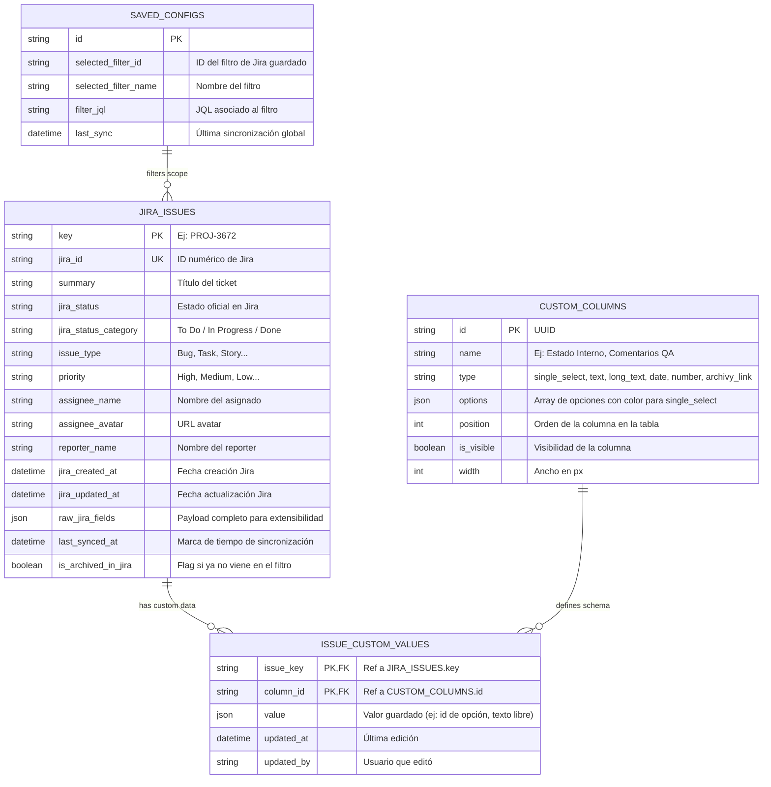

# PLAN DE IMPLEMENTACIÓN: JIRA AIRTABLE-LIKE WEB APP

Aplicación web interna para la gestión visual, moderna y ligera de tickets de Jira con interfaz estilo **Airtable**, conexión por **OAuth 2.0**, persistencia de campos personalizados locales (estados internos, comentarios, single-selects) que **nunca se pierden al sincronizar**, y soporte de integración con **Archivy**.

---

## 1. Arquitectura General y Stack Tecnológico

### Frontend (SPA moderna, reactiva y ultra-ligera)
* **Framework:** React 19 / Vite + TypeScript.
* **Estilos:** Tailwind CSS con paleta inspirada en Airtable (tonos pastel suaves, badges vibrantes, bordes finos, tipografía limpia).
* **Data Grid:** TanStack Table (v8) + Virtualización (`@tanstack/react-virtual`) para soportar miles de tickets con fluidez de 60fps.
* **Componentes UI:** Radix UI / Headless UI (Dropdowns, Popovers, Modales de creación de columnas y filtros) + Lucide React (iconos).
* **Gestión de Estado:** Zustand / TanStack Query (para cacheo, refetch en segundo plano y mutaciones optimistas).

### Backend (API REST y Motor de Sincronización)
* **Framework:** **FastAPI (Python 3.14)** o **Node.js (Express / Fastify + TypeScript)**.
  * *Recomendación:* **FastAPI (Python)** dado que **Archivy** es un ecosistema 100% Python/Flask con APIs en Python, facilitando integrar Archivy directamente o correrlo en paralelo con endpoints unificados.
* **Base de Datos:** SQLite con WAL mode (Write-Ahead Logging) vía SQLAlchemy o Prisma/Better-SQLite3.
  * Portátil, sin necesidad de configurar servidores de base de datos complejos.
  * Almacenamiento local rápido y confiable.

---

## 2. Modelo de Datos y Regla de Persistencia (No-Overwrite)

El requerimiento crítico es que **los campos de Jira se sincronizan (read-only)**, pero **los campos internos creados por el usuario (status interno, comentarios, tags) NUNCA se borran ni se sobreescriben al hacer refresh**.

### Esquema de Base de Datos relacional

### Mecánica de Sincronización Segura:
1. Al pulsar **"Actualizar desde Jira"** o al ejecutarse la carga inicial:
   * Se consulta a la API de Jira con el JQL del filtro configurado.
   * Se hace un **UPSERT** exclusivamente sobre la tabla `JIRA_ISSUES` basado en la clave primaria `key` (ej. `PROJ-3672`).
   * La tabla `ISSUE_CUSTOM_VALUES` **no se toca**. Dado que está indexada por `(issue_key, column_id)`, todos los estados internos, comentarios y notas locales se mantienen intactos y se combinan en memoria con los datos frescos de Jira.
   * Si un ticket desaparece del filtro de Jira, no se borran los datos locales: se marca `is_archived_in_jira = true` para que el usuario no pierda su histórico ni sus notas.

---

## 3. Integración con Jira (Paso 1: OAuth 2.0 y Filtros)

### Configuración OAuth 2.0 (3LO - 3-Legged OAuth de Atlassian)
1. **Pantalla de Configuración Inicial (Setup Wizard):**
   * Configuración de credenciales de Atlassian Developer Console:
     * `Client ID`
     * `Client Secret`
     * `Redirect URI` (ej: `http://localhost:8000/api/auth/jira/callback`)
     * Scopes solicitados: `read:jira-work`, `read:jira-user`, `offline_access`.
   * Botón **"Conectar con Jira"**:
     * Redirige al consent screen de Atlassian.
     * Recibe el `authorization_code`.
     * Intercambia el código por `access_token` y `refresh_token` (almacenados de forma cifrada/segura en base de datos local).
     * Obtiene el `cloudId` de la instancia de Jira (`https://api.atlassian.com/oauth/token/accessible-resources`).
2. **Selección de Filtro Guardado:**
   * La API consulta `/rest/api/3/filter/favourite` o `/rest/api/3/filter/search`.
   * El usuario ve un selector desplegable con sus filtros guardados de Jira (ej: *"Mis Tickets Activos"*, *"Sprint Actual"*, *"Bugs Críticos"*).
   * Al seleccionar un filtro, se guarda como filtro activo de la vista.
3. **Carga y Botón de Actualización Manual:**
   * Botón superior en la barra de herramientas: `[ 🔄 Actualizar Datos ]`.
   * Indicador visual: *"Última sincronización: hace 5 minutos"* y spinner durante el fetch.
   * Paginación transparente de la API de Jira (manejo de lotes de 50/100 registros con `startAt` hasta completar el filtro).

---

## 4. Experiencia de Usuario Estilo Airtable

### Vista de Grilla (Data Grid)
* **Encabezados fijos e interactivos:**
  * Fijar columnas clave (ej: `Key` y `Summary` fijas a la izquierda mientras el resto hace scroll horizontal).
  * Distinción visual clara: Las columnas de Jira tienen un ícono sutil de Jira / candado indicando que son de sólo lectura. Las columnas locales tienen indicadores editables.
* **Tipos de Campos Personalizados Soportados:**
  1. **Single Select (Airtable Style):**
     * Pills/badges con colores configurables (esmeralda, azul cielo, ámbar, coral, violeta, fucsia, etc.).
     * Selector con búsqueda rápida y botón para crear nuevas opciones sobre la marcha.
  2. **Texto Corto / Texto Largo (Comments / Notes):**
     * Edición inline con doble clic o enter.
     * Popover expandible para textos largos con soporte de Markdown.
  3. **Vínculo a Archivy (Knowledge Base):**
     * Badge que indica si el ticket tiene una nota o wiki asociada en Archivy.
* **Barra de Herramientas Superior:**
  * **Filtrar:** Constructor de filtros con condiciones múltiples (`[Campo] [Operador] [Valor]`). Ej: `Jira Status = In Progress` AND `Estado Interno != Bloqueado`.
  * **Ordenar (Sort):** Orden multi-nivel (ascendente / descendente) sobre cualquier campo de Jira o campo personalizado.
  * **Agrupar (Group By):** Agrupación colapsable idéntica a Airtable (ej: agrupar por `Estado Interno`, por `Jira Status` o por `Asignado`), mostrando el contador de registros por grupo y colores temáticos.
  * **Ocultar / Mostrar Columnas:** Menú con switches para mostrar u ocultar campos según la necesidad del usuario.
  * **Agregar Campo (+):** Botón para añadir una nueva columna local en 2 clics.

---

## 5. Integración con Archivy (Knowledge Base & Notas)

**Archivy** (`https://archivy.github.io/`) es una base de conocimiento extensible basada en Markdown, con búsqueda full-text y soporte de tags y bookmarks.

### Propuesta de Integración:
1. **Modo Side-Drawer (Notas de Tickets en Archivy):**
   * Cada fila de Jira tiene un botón de acceso directo o columna "Archivy Wiki".
   * Al hacer clic, se abre un panel lateral deslizante (Drawer) conectado a Archivy.
   * Crea o enlaza automáticamente una nota en Archivy con el título `[PROJ-3672] Resumen del Ticket` y etiquetas `#jira #PROJ-3672`.
   * Permite redactar documentación técnica, análisis de causa raíz (RCA), guías de pruebas o actas de reuniones en Markdown enriquecido.
2. **Acceso y Búsqueda Unificada:**
   * Las notas quedan respaldadas como archivos Markdown en el directorio de Archivy, garantizando portabilidad total.
   * El usuario puede buscar en Archivy desde la app o consultar las notas directamente en la interfaz web de Archivy.

---

## 6. Fases de Ejecución para el Agente Autónomo

El desarrollo se ejecutará ordenadamente en 5 fases modulares:

### Fase 1: Esqueleto del Proyecto y Entorno
- Inicializar repositorio con estructura monorepo o client/server:
  - `server/`: Backend en FastAPI con SQLite y gestión de tokens/configuraciones.
  - `client/`: Frontend en React + Vite + TypeScript + Tailwind CSS.
- Configurar base de datos SQLite y migraciones iniciales (`jira_issues`, `custom_columns`, `issue_custom_values`, `jira_config`).

### Fase 2: Módulo OAuth de Jira y Motor de Sincronización
- Implementar flujo OAuth 2.0 3LO de Atlassian (`/auth/login`, `/auth/callback`, `/auth/status`).
- Implementar endpoints para listar filtros guardados del usuario de Jira.
- Implementar endpoint `/api/sync` con paginación, upsert seguro en `jira_issues` y preservación de `issue_custom_values`.

### Fase 3: Motor de Campos Personalizados y Persistencia
- Endpoints CRUD para columnas personalizadas (`/api/columns`).
- Endpoints para actualización en tiempo real de valores personalizados por ticket (`/api/issues/{key}/custom-values`).
- Validación de persistencia: tests automatizados que simulen un refresh de Jira con cambios en campos de Jira sin alterar las columnas locales.

### Fase 4: Frontend Estilo Airtable
- Implementar Data Grid con TanStack Table:
  - Sticky columns, redimensionamiento, reordenamiento.
  - Renderers de celdas para Jira (read-only) y Custom Fields (inline edit, pickers de color para single-select).
- Barra de herramientas con:
  - Selector de Filtro de Jira + Botón de actualización manual con estado de carga.
  - Modal para agregar y configurar nuevas columnas.
  - Menús de Filtrado, Ordenamiento y Agrupación (Group By) colapsable.

### Fase 5: Integración con Archivy y Entrega
- Integrar cliente/servicio de Archivy para asociar notas Markdown a los tickets de Jira.
- Panel lateral deslizable (Slide-over Drawer) para visualizar y editar notas Markdown vinculadas al ticket.
- Pruebas finales de extremo a extremo, documentación de arranque en `README.md` y scripts de inicio rápido (`npm run dev` / `run.bat`).
