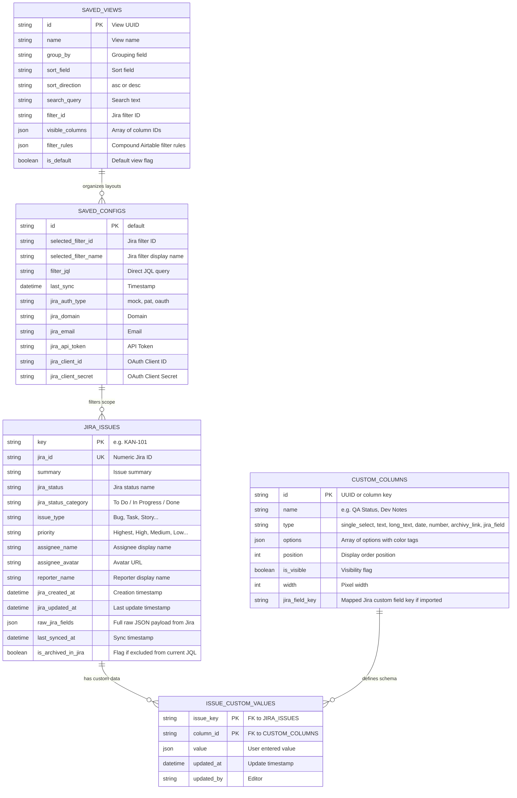

# Implementation Plan: Jira QuickGrid

An internal web application for visual, modern, and lightweight Jira issue management featuring an **Airtable-style** data grid, **OAuth 2.0 (3LO)** and **API Token** authentication, persistent local custom fields (internal statuses, QA commentary, color single-selects) that are **never overwritten during sync**, and integrated **Archivy** Markdown knowledge base support.

---

## 1. High-Level Architecture & Tech Stack

### Frontend (SPA, Reactive & Local-First)
* **Framework:** React 19 / Vite + TypeScript.
* **Styling:** Tailwind CSS v4 with an Airtable-inspired palette (soft pastel pills, subtle borders, high-density typography).
* **Data Grid:** TanStack Table v8 with dynamic horizontal scrolling and sticky columns (`Key`, `Summary`).
* **Icons & UI:** Lucide React icons.
* **Bilingual Support:** Integrated English & Spanish localization dictionary (`client/src/utils/i18n.ts`).

### Backend (REST API & Sync Engine)
* **Framework:** FastAPI (Python 3.10+).
* **Database:** SQLite with WAL mode (Write-Ahead Logging) and foreign keys enabled via SQLAlchemy (`server/database.py`).
* **Local Persistence:** Embedded SQLite (`jira_app.db`) and Markdown file storage (`server/data/archivy_notes/`).

---

## 2. Relational Data Model & No-Overwrite Guarantee

The critical architectural invariant is that **Jira fields are strictly synchronized in a read-only mirror**, while **local fields created by the user (internal status, QA notes, custom tags) are NEVER erased or overwritten upon sync**.

### Entity-Relationship Diagram

---

## 3. Jira Synchronization Flow

1. **JQL Query Execution:** Fetches issues matching user's selected Jira filter or direct JQL (`/rest/api/3/search/jql`).
2. **UPSERT on `jira_issues`:** Inserts new issues or updates existing Jira attributes.
3. **Preservation of `issue_custom_values`:** The local custom values table is strictly indexed by `(issue_key, column_id)` and is never updated or purged by the Jira sync cycle.
4. **Scope Archival:** Issues that no longer match the current filter query are flagged `is_archived_in_jira = True` so the UI reflects the exact sprint or filter scope.

---

## 4. Airtable-Style Filtering Engine

* **Compound Rules:** Global `AND` / `OR` conjunction toggle.
* **Operators:**
  * Multi-select & Arrays: `has any of`, `has all of`, `has none of`, `is exactly`.
  * Text: `contains`, `not contains`, `is`, `is not`, `starts with`, `ends with`, `is empty`, `is not empty`.
  * Numbers: `=`, `≠`, `>`, `<`, `≥`, `≤`, `is empty`, `is not empty`.
  * Dates: `is`, `is before`, `is after`, `is today`, `is empty`, `is not empty`.
* **Dynamic Tag Picker:** Interactive pill container allowing one-click tag additions from discovered issue data and manual tag creation.
* **Saved View Persistence:** Active filter trees are preserved in `saved_views.filter_rules` and restored on view tab changes.
